中文 | [English](README_EN.md)- [数字集成电路前端设计与高层次综合](#数字集成电路前端设计与高层次综合)
- [数字集成电路前端设计与高层次综合](#数字集成电路前端设计与高层次综合)
  - [1.写在前面](#1写在前面)
    - [1.1 软件硬件环境](#11-软件硬件环境)
  - [2.实验内容](#2实验内容)
    - [2.1 实验 1](#21-实验-1)
    - [2.2 实验 2](#22-实验-2)
    - [2.3 实验 3](#23-实验-3)
    - [2.4 实验 4](#24-实验-4)
    - [2.5 实验 5](#25-实验-5)
    - [2.6 实验 6](#26-实验-6)
  - [3.ZedBoard实验（课程所使用板子）](#3zedboard实验课程所使用板子)
    - [3.1 实验 1](#31-实验-1)
    - [3.2 实验 2](#32-实验-2)
    - [3.3 实验 3](#33-实验-3)
    - [3.4 实验 4](#34-实验-4)
    - [3.5 实验 5](#35-实验-5)
    - [3.6 实验 6](#36-实验-6)
  - [4.课程设计（开发中）](#4课程设计开发中)

# 数字集成电路前端设计与高层次综合 
## 1.写在前面
 本课程由中山大学电子与信息工程学院（微电子学院）School of Electronics and Information Technology (School of Microelectronics)
开设。

这是一门实用主义的课程，可以学到**很多东西**，由于课程提供的lab板子和手上的板子不一样，所以对代码进行一些修改，以适应自己的板子。

我写这个项目的目的一来是完成6个lab与课程设计，用于提交作业。另外是为后来者可能有使用同一个板子的人提供一些参考（因为我看到这个板子在直接搜索FPGA时还是比较多人买的）。

### 1.1 软件硬件环境
- Windows 11
- Vivado 2024.1
- Chip: xc7z010clg400-1
  
**PCB 级别资料**:
  - [原理图](./datasheet/AX7010开发板原理图.pdf)（比较重要的，能找到各种引脚的定义）
  - [PCB Design Guide](./datasheet/ug933-Zynq-7000-PCB.pdf)
  
**芯片级别资料**:
  - [Zynq-7000 Data Sheet](./datasheet/ds187-XC7Z010-XC7Z020-Data-Sheet.pdf)
  - [XADC User Guide](./datasheet/ug480_7Series_XADC.pdf)
  - [Technical Reference Manual (TRM)](./datasheet/ug585-Zynq-7000-TRM.pdf)
  - [Software Development Guide](./datasheet/ug821-zynq-7000-swdev.pdf)
  - [Package Pinout Guide](./datasheet/ug865-Zynq-7000-Pkg-Pinout.pdf)

**板子**:
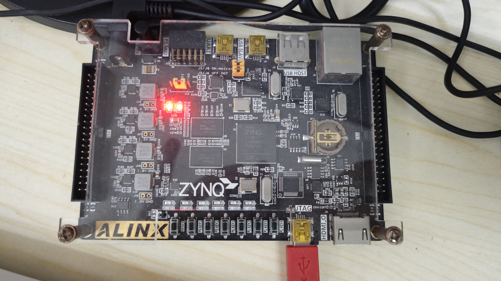

## 2.实验内容
### 2.1 实验 1
> **重要文件：** [lab1 实验手册](./datasheet/lab1.pdf)

具体的操作内容已经包含在上述的 PDF 中，本项目主要是将里面的 `labX.v`、`lab1_tb.v`、`lab1.xdc` 这三个文件进行修改，以适应自己的板子。

上述三个文件分别对应的是 Verilog 代码、Testbench 代码、约束文件。
- **`labX.v`**：硬件描述
- **`lab1_tb.v`**：仿真
- **`lab1.xdc`**：约束

**实验结果**:

以下图片和动画展示了实验的运行结果

*行为仿真*

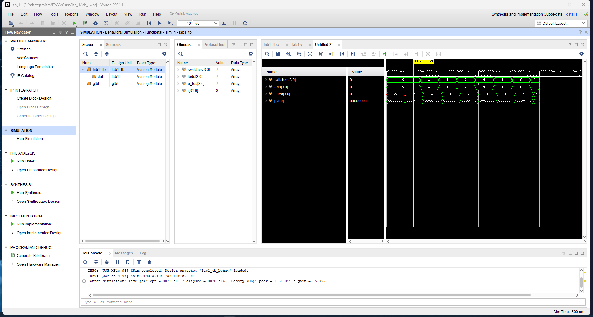

*项目概要*

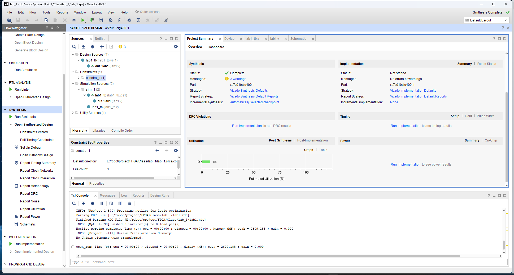

*综合后的电路图*

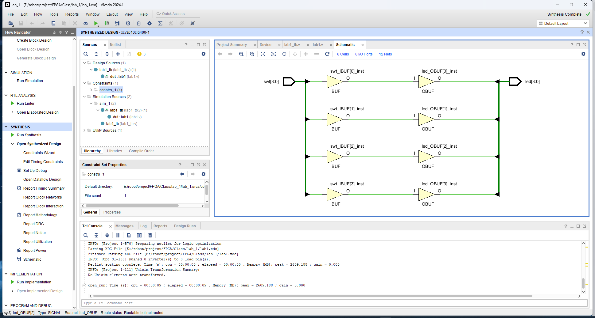

*设备实现*

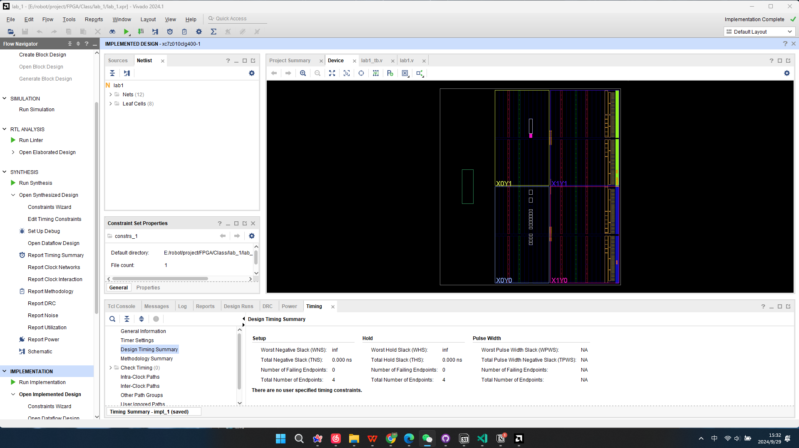

*后时序仿真*

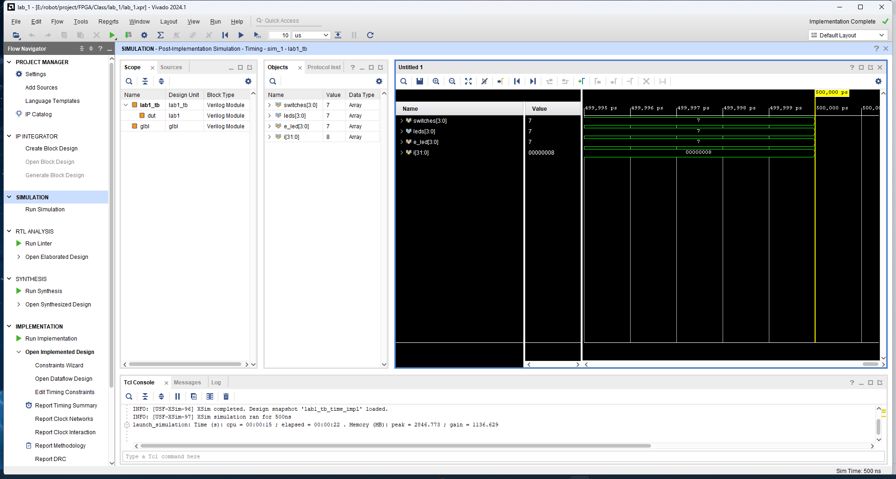

*最终测试*

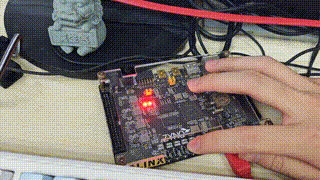
### 2.2 实验 2
> **重要文件：** [lab2 实验手册](./datasheet/lab2.pdf)

(正在开发中)

### 2.3 实验 3
> **重要文件：** [lab3 实验手册](./datasheet/lab3.pdf)

(正在开发中)

### 2.4 实验 4
> **重要文件：** [lab4 实验手册](./datasheet/lab4.pdf)

(正在开发中)

### 2.5 实验 5
> **重要文件：** [lab5 实验手册](./datasheet/lab5.pdf)

(正在开发中)

### 2.6 实验 6
> **重要文件：** [lab6 实验手册](./datasheet/lab6.pdf)

(正在开发中)

## 3.ZedBoard实验（课程所使用板子）
### 3.1 实验 1
> **重要文件：** [lab1 实验手册](./datasheet/lab1.pdf)

**实验结果**

以下图片和动画展示了实验的运行结果
*行为仿真*

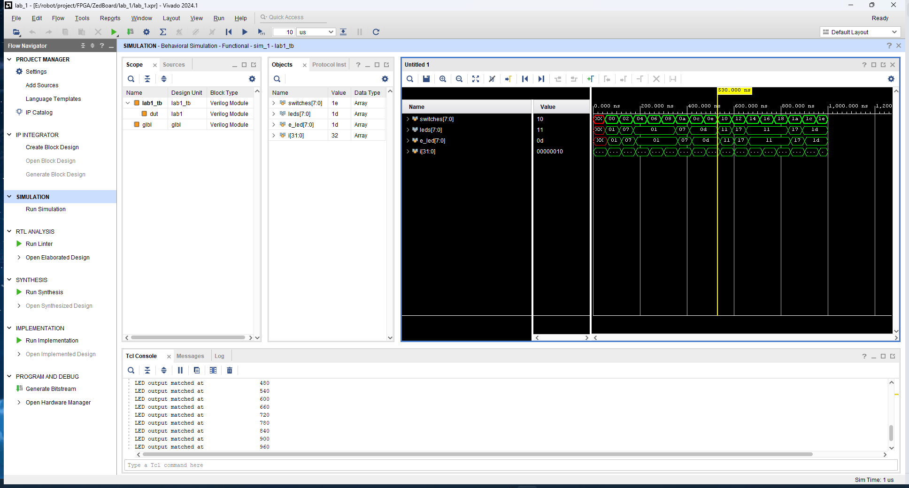

*项目概要*

*综合后的电路图*

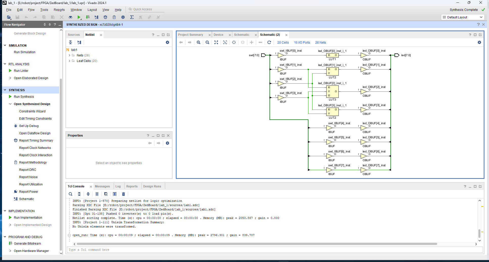

*设备实现*

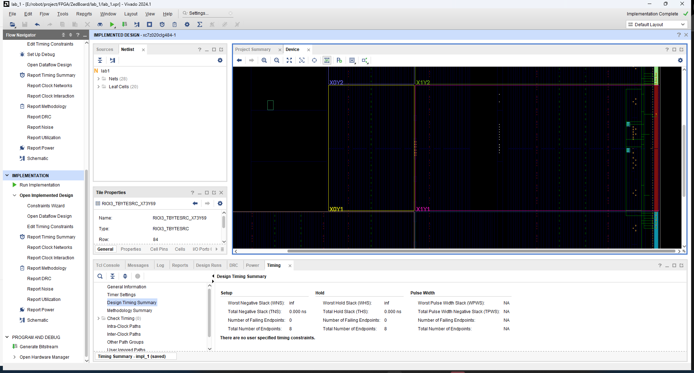

*后时序仿真*

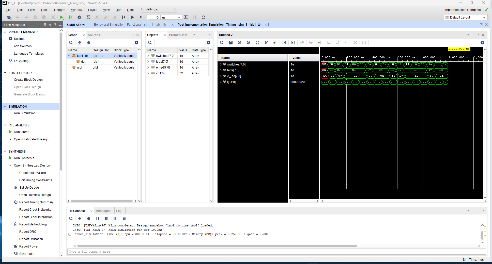

*最终测试*

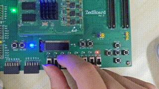

### 3.2 实验 2
> **重要文件：** [lab2 实验手册](./datasheet/lab2.pdf)

(正在开发中)

### 3.3 实验 3
> **重要文件：** [lab3 实验手册](./datasheet/lab3.pdf)

(正在开发中)

### 3.4 实验 4
> **重要文件：** [lab4 实验手册](./datasheet/lab4.pdf)

(正在开发中)

### 3.5 实验 5
> **重要文件：** [lab5 实验手册](./datasheet/lab5.pdf)

(正在开发中)

### 3.6 实验 6
> **重要文件：** [lab6 实验手册](./datasheet/lab6.pdf)

## 4.课程设计（开发中）
