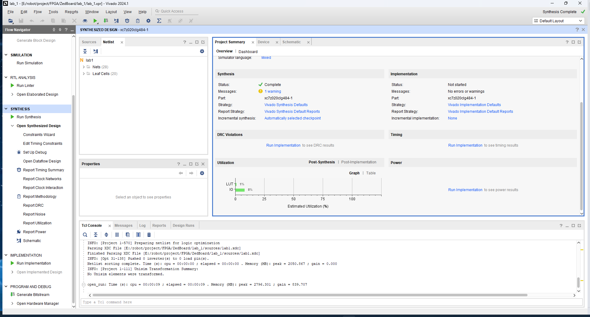
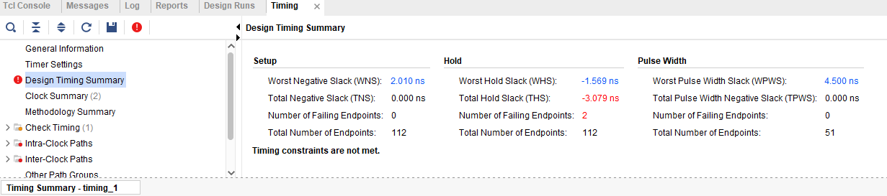

中文 | [English](README_EN.md)
- [数字集成电路前端设计与高层次综合](#数字集成电路前端设计与高层次综合)
  - [1.写在前面](#1写在前面)
    - [1.1 软件硬件环境](#11-软件硬件环境)
  - [2.实验内容](#2实验内容)
    - [2.1 实验 1](#21-实验-1)
    - [2.2 实验 2](#22-实验-2)
    - [2.3 实验 3](#23-实验-3)
    - [2.4 实验 4](#24-实验-4)
    - [2.5 实验 5](#25-实验-5)
    - [2.6 实验 6](#26-实验-6)
  - [3.ZedBoard实验（课程所使用板子）](#3zedboard实验课程所使用板子)
    - [3.1 实验 1](#31-实验-1)
    - [3.2 实验 2](#32-实验-2)
    - [3.3 实验 3](#33-实验-3)
    - [3.4 实验 4](#34-实验-4)
    - [3.5 实验 5](#35-实验-5)
    - [3.6 实验 6](#36-实验-6)
  - [4.课程设计（开发中）](#4课程设计开发中)
- [勘误](#勘误)


# 数字集成电路前端设计与高层次综合 
## 1.写在前面
 本课程由中山大学电子与信息工程学院（微电子学院）School of Electronics and Information Technology (School of Microelectronics)
开设。</p>
这是一门实用主义的课程，可以学到**很多东西**，由于课程提供的lab板子和手上的板子不一样，所以对代码进行一些修改，以适应自己的板子。</p>
我写这个项目的目的一来是完成6个lab与课程设计，用于提交作业。另外是为后来者可能有使用同一个板子的人提供一些参考（因为我看到这个板子在直接搜索FPGA时还是比较多人买的）。</p>
### 1.1 软件硬件环境
- Windows 11
- Vivado 2024.1
- Chip: xc7z010clg400-1

**AX7010资料**
  - [原理图](./datasheet/AX7010开发板原理图.pdf)（比较重要的，能找到各种引脚的定义）
  - [PCB Design Guide](./datasheet/ug933-Zynq-7000-PCB.pdf)
  - [Zynq-7000 Data Sheet](./datasheet/ds187-XC7Z010-XC7Z020-Data-Sheet.pdf)
  - [XADC User Guide](./datasheet/ug480_7Series_XADC.pdf)
  - [Technical Reference Manual (TRM)](./datasheet/ug585-Zynq-7000-TRM.pdf)
  - [Software Development Guide](./datasheet/ug821-zynq-7000-swdev.pdf)
  - [Package Pinout Guide](./datasheet/ug865-Zynq-7000-Pkg-Pinout.pdf)

**板子**:


**ZedBoard资料**
- [ZedBoard原理图](./datasheet/AVNET%20Zedboard/zedbaord%20原理图.pdf)
- [ZedBoard Zynq-7000 ARM FPGA进阶手册](./datasheet/AVNET%20Zedboard/ZedBoard%20Zynq-7000%20ARM%20FPGA进阶手册.pdf)
- [ZedBoard用户硬件手册](./datasheet/AVNET%20Zedboard/zedboard%20用户硬件手册.pdf)
- [ZedBoard Schematic](./datasheet/AVNET%20Zedboard/ZedBoard_Schematic.pdf)
- [ZedBoard上手手册](./datasheet/AVNET%20Zedboard/zedboard上手手册.pdf)
- [底板原理图](./datasheet/AVNET%20Zedboard/底板原理图.pdf)
- [核心板原理图](./datasheet/AVNET%20Zedboard/核心板原理图.pdf)
- [上手手册（手把手）](./datasheet/AVNET%20Zedboard/上手手册（手把手）.pdf)


**ZedBoard**:


## 2.实验内容
### 2.1 实验 1
> **重要文件：** [lab1 实验手册](./datasheet/lab1.pdf)

具体的操作内容已经包含在上述的 PDF 中，本项目主要是将里面的 `labX.v`、`lab1_tb.v`、`lab1.xdc` 这三个文件进行修改，以适应自己的板子。

上述三个文件分别对应的是 Verilog 代码、Testbench 代码、约束文件。
- **`labX.v`**：硬件描述
- **`lab1_tb.v`**：仿真
- **`lab1.xdc`**：约束

**实验结果**:

以下图片和动画展示了实验的运行结果

*行为仿真*


*项目概要*


*综合后的电路图*


*设备实现*


*后时序仿真*


*最终测试*


### 2.2 实验 2
> **重要文件：** [lab2 实验手册](./datasheet/lab2.pdf)

(正在开发中)

### 2.3 实验 3
> **重要文件：** [lab3 实验手册](./datasheet/lab3.pdf)

(正在开发中)

### 2.4 实验 4
> **重要文件：** [lab4 实验手册](./datasheet/lab4.pdf)

(正在开发中)

### 2.5 实验 5
> **重要文件：** [lab5 实验手册](./datasheet/lab5.pdf)

(正在开发中)

### 2.6 实验 6
> **重要文件：** [lab6 实验手册](./datasheet/lab6.pdf)

(正在开发中)

## 3.ZedBoard实验（课程所使用板子）
### 3.1 实验 1
> **重要文件：** [lab1 实验手册](./datasheet/lab1.pdf)

**代码解析**

下面是 `lab1` 模块的代码（可以在lab1.v中找到），主要用来控制 ZedBoard 上的 LED 显示。每个 LED 的亮灭由相应的开关位置决定。具体逻辑如下：</p>
**仿真的代码类似，不赘述请自行查阅**。

- `led[0]` 对应 `swt[0]` 的反相值。
- `led[1]` 通过 `swt[1]` 和 `swt[2]` 的组合逻辑控制。
- 其余的 `led[2]`, `led[3]` 也是基于开关的不同逻辑组合。
- `led[7:4]` 直接对应 `swt[7:4]`，即这些 LED 直接显示对应开关的状态。

代码实现如下：

```verilog
module lab1(
    input [7:0] swt,
    output [7:0] led
    );

    assign led[0] = ~swt[0];
    assign led[1] = swt[1] & ~swt[2];
    assign led[3] = swt[2] & swt[3];
    assign led[2] = led[1] | led[3];

    assign led[7:4] = swt[7:4];

endmodule
```

引脚约束文件 `lab1.xdc` 用于将开关和 LED 连接到 ZedBoard 的物理引脚。以下是约束文件的内容：</p>
<sub>由于 XDC 一般涉及较多的重复操作，我们分别举一 LED 和 swt 一个的例子，其余的逻辑相似。</sub>

- `set_property PACKAGE_PIN`：这个命令用于将逻辑端口（例如 `swt[0]` 或 `led[0]`）映射到 ZedBoard 的物理引脚。在这个例子中，`swt[0]` 被分配给引脚 `F22`，而 `led[0]` 被分配给引脚 `T22`。

- `set_property IOSTANDARD LVCMOS33`：这个命令指定了引脚的输入输出标准。在这里，我们使用了 `LVCMOS33`，这是一种常用的电平标准，表示引脚工作在 3.3V 的逻辑电平下。</p>

代码实现如下：
```xdc
set_property PACKAGE_PIN F22 [get_ports swt[0]]
set_property IOSTANDARD LVCMOS33 [get_ports swt[0]]

set_property PACKAGE_PIN T22 [get_ports led[0]]
set_property IOSTANDARD LVCMOS33 [get_ports led[0]]
```
**实验结果**

以下图片和动画展示了实验的运行结果
*行为仿真*


*项目概要*



*综合后的电路图*


*设备实现*


*后时序仿真*


*最终测试*


### 3.2 实验 2
> **重要文件：** [lab2 实验手册](./datasheet/lab2.pdf)

**代码解析**

这个实验相较于上一个实验较复杂，涉及了6个Verilog文件，我们先进行一个层级分类。</p>

- `uart_led.v`
  - `meta_harden.v`
  - `uart_rx.v`
    - `meta_harden.v`
    - `uart_baud_gen.v`
    - `uart_rx_ctl.v`
  - `led_ctl.v`

这就是这个lab的设计层级结果，可以理解成每个v文件调用了别的v文件中的模块，最终形成了一个完整的项目。</p>
我们从上往下分析，首先是 `uart_led.v` 文件，该顶层文件主要是调用模块和传递参数，把uart和led拼接起来。具体可以自行查看代码</p>
`led_ctl.v` 文件定义了一个led模块，并且可以将一个8位的数据传递给led模块，led会进显示。</p>
主要实现的代码部分如下：
```verilog
  always @(posedge clk_rx)
  begin
    if (rst_clk_rx)
    begin
      old_rx_data_rdy <= 1'b0;
      char_data       <= 8'b0;
      led_o           <= 8'b0;
    end
    else
    begin
      // Capture the value of rx_data_rdy for edge detection
      old_rx_data_rdy <= rx_data_rdy;

      // If rising edge of rx_data_rdy, capture rx_data
      if (rx_data_rdy && !old_rx_data_rdy)
      begin
        char_data <= rx_data;
      end

      // Output the normal data or the data with high and low swapped
      if (btn_clk_rx)
        led_o <= {char_data[3:0],char_data[7:4]};
      else
        led_o <= char_data;
    end // if !rst
  end // always
```
其中`always @(posedge clk_rx)`是每当clk_rx上升沿时就会进入该模块，首先利用`if (rst_clk_rx)`判断是否处于复位状态，如果是则将`old_rx_data_rdy`、`char_data`、`led_o`都置为0（即重置所有状态），否则就会进入else部分</p>
当不处于复位状态（进入else）时，首先将`rx_data_rdy`这个串口数据已经准备好的参数<=给`old_rx_data_rdy`</p>
<sub>需要注意的是这里的`<=`是非阻塞赋值，该操作会在所有always模块执行完后才进行更新！！！</sub></p>
接下来进行`if (rx_data_rdy && !old_rx_data_rdy)`判断。</p>
该判定逻辑是如果当前时钟周期的rdy是1（表示有rx数据）同时上一个时钟周期的rdy是0（表示上一个周期没有数据），则说明这是一个`新的数据`，此时更新`char_data`为`rx_data`（即串口数据）</p>
<sub>需要注意的是由于非阻塞赋值的情况存在，`old_rx_data_rdy`在if判断的时候还未更新，所以是上一个时钟周期的值。同时后续操`char_data`的更新最终也发生在always模块执行之后。</sub></p>
最后是led显示部分，首先检测`btn_clk_rx`（外部输入按钮）的值是否为1，如果是则将`led_o`的低4位和高4位交换，否则直接显示`char_data`</p>
***
接下来说明一下`meta_harden.v`与`uart_baud_gen.v`的作用</p>
`meta_harden.v`主要实现了双重同步的功能，目的是将一个异步信号同步到目标时钟域</p>
简单来说，假设这个异步信号是按键，按键被触发并不是同步于FPGA时钟信号的，当触发的时候刚好在时钟信号的上升沿时候，就会出现这个按键电平变得不稳定（亚稳态）导致后续读取问题。这是异步信号同步会发生的问题，所以需要一个双重同步的过程</p>
实现代码：
```verilog
  always @(posedge clk_dst)
  begin
    if (rst_dst)
    begin
      signal_meta <= 1'b0;
      signal_dst  <= 1'b0;
    end
    else // if !rst_dst
    begin
      signal_meta <= signal_src;
      signal_dst  <= signal_meta;
    end // if rst
  end // always
```
双重同步实现起来并不复杂，首先要理解前面提到的非阻塞赋值概念，即`<=`操作会在所有always模块执行完后才进行更新。所以在这个模块中，首先将`signal_src`赋值给`signal_meta`，下个周期才能再将`signal_meta`赋值给`signal_dst`</p>
<sub>当然根据这个原理你也可以实现n重同步，多写几个<=赋值即可，具体取决于项目需求</sub></p>
***
`uart_baud_gen.v`主要是用来产生波特率，该部分重点是实现过采样</p>
我们先首先要理解他的逻辑部分，稍后我们会进行分析如何得到这个频率计数数值。</p>
逻辑代码如下：
```verilog
assign internal_count_m_1 = internal_count - 1'b1;
  always @(posedge clk)
  begin
    if (rst)
    begin
      internal_count  <= OVERSAMPLE_VALUE;
      baud_x16_en_reg <= 1'b0;
    end
    else
    begin
      // Assert baud_x16_en_reg in the next clock when internal_count will be
      // zero in that clock (thus when internal_count_m_1 is 0).
      baud_x16_en_reg   <= (internal_count_m_1 == {CNT_WID{1'b0}});
      // Count from OVERSAMPLE_VALUE down to 0 repeatedly
      if (internal_count == {CNT_WID{1'b0}}) 
      begin
        internal_count    <= OVERSAMPLE_VALUE;
      end
      else // internal_count is not 0
      begin
        internal_count    <= internal_count_m_1;
      end
    end // if rst
  end // always 
```
首先我们得大概了解一下`assign internal_count_m_1 = internal_count - 1'b1;`的作用，这是一个连续赋值的语句，物理上是通过硬件组合逻辑实现，当internal_count变化时，internal_count_m_1也会马上变化，不需要等待时钟同步。</p>
该模块`always @(posedge clk)`是在每一个时钟上升沿进入，当复位时候赋值`internal_count`为`OVERSAMPLE_VALUE`，同时`baud_x16_en_reg`为0</p>
上述逻辑部分实现了，每多少个时钟周期触发一次`baud_x16_en_reg`，假设时钟周期是1Khz，每10次触发一次就是进行100Hz的采样，如果波特率是10Hz那么就进行了10倍的过采样</p>
实现代码：
```verilog
  parameter BAUD_RATE    = 57_600;              // Baud rate
  parameter CLOCK_RATE   = 50_000_000;
  // The OVERSAMPLE_RATE is the BAUD_RATE times 16
  localparam OVERSAMPLE_RATE = BAUD_RATE * 16;
  // The divider is the CLOCK_RATE / OVERSAMPLE_RATE - rounded up
  // (so add 1/2 of the OVERSAMPLE_RATE before the integer division)
  localparam DIVIDER = (CLOCK_RATE+OVERSAMPLE_RATE/2) / OVERSAMPLE_RATE;
  // The value to reload the counter is DIVIDER-1;
  localparam OVERSAMPLE_VALUE = DIVIDER - 1;
  // The required width of the counter is the ceiling of the base 2 logarithm
  // of the DIVIDER
  localparam CNT_WID = clogb2(DIVIDER);
```
该部分就是实现了计算`OVERSAMPLE_VALUE`的值，也就是上述提到的每多少次触发一次`baud_x16_en_reg`的值</p>
减去1是因为计数器是从0开始的</p>
clogb2(DIVIDER)的作用是计算DIVIDER的二进制位数，这样就可以得到一个合适的计数器宽度，可以节省资源</p>
实现代码：
```verilog
  function integer clogb2;
    input [31:0] value;
    reg   [31:0] my_value;
    begin
      my_value = value - 1;
      for (clogb2 = 0; my_value > 0; clogb2 = clogb2 + 1)
        my_value = my_value >> 1;
    end
  endfunction
```
主要逻辑就是一直将value右移，直到为0，同时每一次右移的时候clogb2+1，最终得到的clogb2就是value的二进制位数</p>
***
最后是`uart_rx.v`与`uart_rx_ctl.v`的作用</p>
`uart_rx.v`主要是调用与传递参数，类似于`uart_led.v`</p>
重点部分是`uart_rx_ctl.v`，该部分主要是实现了一个串口接收控制器，主要是接收串口数据并且进行解码</p>
这部分的代码比较长，里面有详细的注释，这里大概说明一下作用，详细可以对照代码查看</p>
总共有五个always同步进行的逻辑部分，后续简称`模块X`</p>
`模块1`实现的是状态机功能，在每一个时钟周期上升沿进行状态更新</p>
`模块2`实现的是在判断到有数据时候，在第八个过采样读取当前bit的值，后续从起始位中间开始每16个过采样读取一次bit，也就是每次读取过采样的中间值，防止出现数据不稳定等情况</p>
`模块3`实现的是记录当前读取的bit数</p>
`模块4`实现的是判断bit位数是否正确产生`rx_data_rdy`信号</p>
`模块5`是用于停止位校验，正常情况下停止位应该是1，如果不是则表示数据错误，通过`frm_err`传递结果</p>
需要注意的是这些always是同步进行的，也就是在时钟沿上升的时候同步开始执行所有部分（读取的是上一个周期的数据）</p>

**实验结果**

以下图片和动画展示了实验的运行结果

*优化前电路图*


*设备视图*


*功率报告*


*项目概要*


*优化后电路图*


*时序分析报告（存在时序违规）*


*检查点文件*


*最终测试*


### 3.3 实验 3
> **重要文件：** [lab3 实验手册](./datasheet/lab3.pdf)

**代码解析**
代码部分和lab2一样，不赘述</p>

**实验结果**

*时序报告*


*输出数据路径*


*修改后的时序*


*设备路径*


*项目概要*


*时序报告_imp*


*修改后的时序_imp"


*时钟路径*


*最终测试*</p>
和lab2现象一样，具体可以看lab2的最终测试</p>

### 3.4 实验 4
> **重要文件：** [lab4 实验手册](./datasheet/lab4.pdf)

(正在开发中)

### 3.5 实验 5
> **重要文件：** [lab5 实验手册](./datasheet/lab5.pdf)

该实验主要是教学使用IO Planing进行约束，代码和实验2是一样的。</p>
需要注意的点：在top module改名后，**在project summary中的top module也要改名**，否则会出现找不到ios模块的错误。</p>

***实验结果**

*找到Y9_PIN*


*完成所有设置*


*路径11*


*最终测试*</p>
和lab2现象一样，具体可以看lab2的最终测试</p>


### 3.6 实验 6
> **重要文件：** [lab6 实验手册](./datasheet/lab6.pdf)

## 4.课程设计（开发中）

# 勘误
在 `lab2` 的顶层文件 `uart_led.v` 中，存在一个关于 `rst_clk` 信号处理的错误：
该错误源于在设计中对 `rst_clk` 信号应用了反转操作，导致按键未按下时（默认低电平），`rst_clk` 被错误地反转为高电平，使得复位信号始终处于激活状态。由于复位信号持续有效，系统在无操作状态下无法正常工作，必须手动按下复位键，才能看到期望的实验现象。</p>
具体出现在`uart_led.v`的69行：
```verilog
    .signal_src   (~rst_pin),
```
<sub>相同代码逻辑的lab3、lab5、lab6中并未出现此问题，为正常的不加反转操作</sub></p>
- [ ] **联系老师更改错误**</p>  <!--需要联系老师-->

错误的逻辑实验现象:

