[中文](README.md) | English
- [Front-end Design of Digital Integrated Circuits and High-level Synthesis](#front-end-design-of-digital-integrated-circuits-and-high-level-synthesis)
  - [1. Preface](#1-preface)
    - [1.1 Software and Hardware Environment](#11-software-and-hardware-environment)
  - [2. Lab Content](#2-lab-content)
    - [2.1 Lab 1](#21-lab-1)
    - [2.2 Lab 2](#22-lab-2)
    - [2.3 Lab 3](#23-lab-3)
    - [2.4 Lab 4](#24-lab-4)
    - [2.5 Lab 5](#25-lab-5)
    - [2.6 Lab 6](#26-lab-6)
  - [3. ZedBoard Experiments (Board Used in the Course)](#3-zedboard-experiments-board-used-in-the-course)
    - [3.1 Experiment 1](#31-experiment-1)
    - [3.2 Experiment 2](#32-experiment-2)
    - [3.3 Experiment 3](#33-experiment-3)
    - [3.4 Experiment 4](#34-experiment-4)
    - [3.5 Experiment 5](#35-experiment-5)
    - [3.6 Experiment 6](#36-experiment-6)
  - [4. Course Design (In Development)](#4-course-design-in-development)

# Front-end Design of Digital Integrated Circuits and High-level Synthesis
## 1. Preface
This course is offered by the School of Electronics and Information Technology (School of Microelectronics) at Sun Yat-sen University.

This is a practical course where you can learn **a lot of things**. Since the provided lab board is different from the one at hand, modifications were made to the code to adapt it to my board.

The purpose of this project is, firstly, to complete the six labs and the course design as part of the coursework submission. Secondly, it aims to provide a reference for those who may use the same board in the future (as I have noticed that this board is still quite popular among FPGA buyers).


### 1.1 Software and Hardware Environment
- Windows 11
- Vivado 2024.1
- Chip: xc7z010clg400-1
  
**PCB-Level Resources**:
  - [Schematic](./datasheet/AX7010开发板原理图.pdf) (Very important, contains definitions of various pins)
  - [PCB Design Guide](./datasheet/ug933-Zynq-7000-PCB.pdf)
  
**Chip-Level Resources**:
  - [Zynq-7000 Data Sheet](./datasheet/ds187-XC7Z010-XC7Z020-Data-Sheet.pdf)
  - [XADC User Guide](./datasheet/ug480_7Series_XADC.pdf)
  - [Technical Reference Manual (TRM)](./datasheet/ug585-Zynq-7000-TRM.pdf)
  - [Software Development Guide](./datasheet/ug821-zynq-7000-swdev.pdf)
  - [Package Pinout Guide](./datasheet/ug865-Zynq-7000-Pkg-Pinout.pdf)

**Board**:
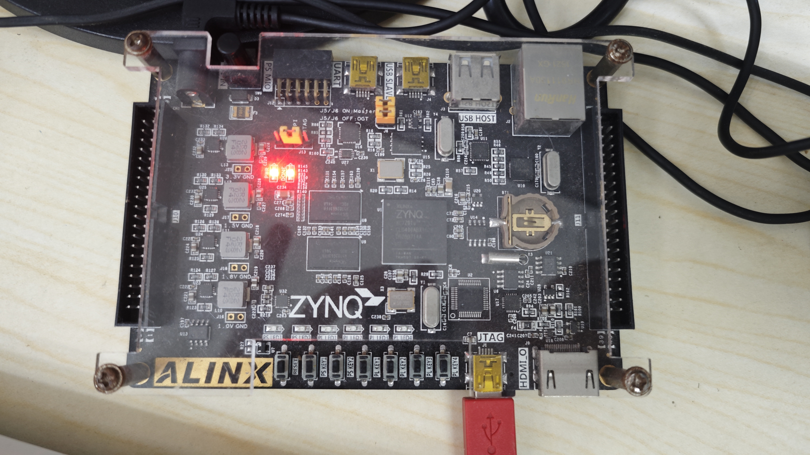

**ZedBoard**:


## 2. Lab Content
### 2.1 Lab 1
> **Important Document:** [Lab 1 Manual](./datasheet/lab1.pdf)

The detailed steps are provided in the PDF above. In this project, the main goal is to modify the three files `labX.v`, `lab1_tb.v`, and `lab1.xdc` to adapt them to the specific board.

The three files correspond to Verilog code, Testbench code, and constraints, respectively:
- **`labX.v`**: Hardware description
- **`lab1_tb.v`**: Simulation
- **`lab1.xdc`**: Constraints

**Lab Results**:

The following images and animation show the results of the experiment:

*Behavioral Simulation*

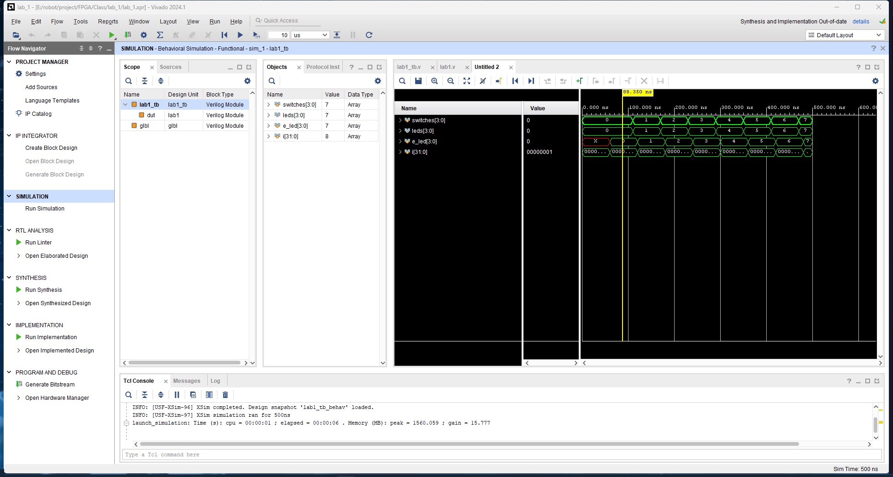

*Project Summary*


*Schematic after Synthesis*


*Device Implementation*


*Post-Timing Simulation*

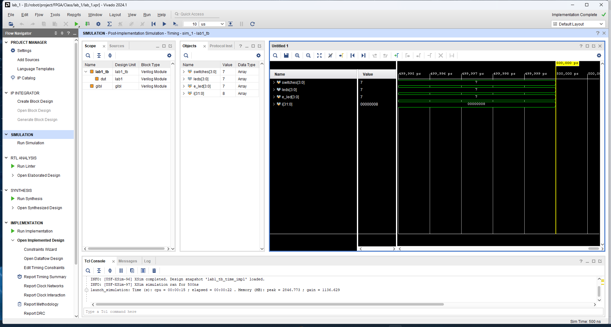

*Final Test*


### 2.2 Lab 2
> **Important Document:** [Lab 2 Manual](./datasheet/lab2.pdf)

(In development)

### 2.3 Lab 3
> **Important Document:** [Lab 3 Manual](./datasheet/lab3.pdf)

(In development)

### 2.4 Lab 4
> **Important Document:** [Lab 4 Manual](./datasheet/lab4.pdf)

(In development)

### 2.5 Lab 5
> **Important Document:** [Lab 5 Manual](./datasheet/lab5.pdf)

(In development)

### 2.6 Lab 6
> **Important Document:** [Lab 6 Manual](./datasheet/lab6.pdf)

(In development)
## 3. ZedBoard Experiments (Board Used in the Course)

### 3.1 Experiment 1
> **Important Document:** [Lab 1 Manual](./datasheet/lab1.pdf)

**Code Analysis**

Below is the code for the `lab1` module (available in `lab1.v`), which is mainly used to control the LED display on the ZedBoard. Each LED is controlled by the corresponding switch position. The specific logic is as follows:</p>
**The simulation code is similar and is not described here in detail; please refer to it directly.**

- `led[0]` corresponds to the inverted value of `swt[0]`.
- `led[1]` is controlled by the combination logic of `swt[1]` and `swt[2]`.
- `led[2]` and `led[3]` are also based on different combinations of switches.
- `led[7:4]` directly correspond to `swt[7:4]`, meaning these LEDs directly show the state of the corresponding switches.

The code implementation is as follows:
```verilog
module lab1(
    input [7:0] swt,
    output [7:0] led
    );

    assign led[0] = ~swt[0];
    assign led[1] = swt[1] & ~swt[2];
    assign led[3] = swt[2] & swt[3];
    assign led[2] = led[1] | led[3];

    assign led[7:4] = swt[7:4];
endmodule
```
The pin constraint file `lab1.xdc` is used to connect the switches and LEDs to the physical pins on the ZedBoard. Below is the content of the constraint file:</p>
<sub>Since XDC files usually involve a lot of repetitive operations, we provide an example for one LED and one switch. The rest of the logic is similar.</sub>

- **`set_property PACKAGE_PIN`**: This command is used to map a logical port (e.g., `swt[0]` or `led[0]`) to a physical pin on the ZedBoard. In this example, `swt[0]` is assigned to pin `F22`, while `led[0]` is assigned to pin `T22`.

- **`set_property IOSTANDARD LVCMOS33`**: This command specifies the input/output standard for the pin. Here, we use `LVCMOS33`, which is a common voltage level standard indicating that the pin operates at a 3.3V logic level.

The code implementation is as follows:
```xdc
set_property PACKAGE_PIN F22 [get_ports swt[0]]
set_property IOSTANDARD LVCMOS33 [get_ports swt[0]]

set_property PACKAGE_PIN T22 [get_ports led[0]]
set_property IOSTANDARD LVCMOS33 [get_ports led[0]]
```
**Experimental Results**

The following images and animations show the results of the experiment:

*Behavioral Simulation*

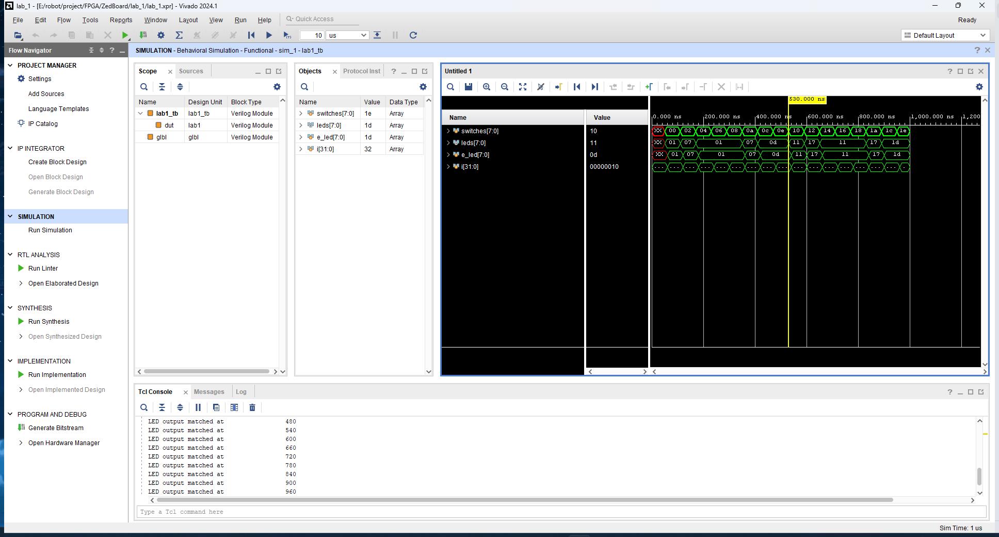

*Project Summary*


*Schematic After Synthesis*


*Device Implementation*

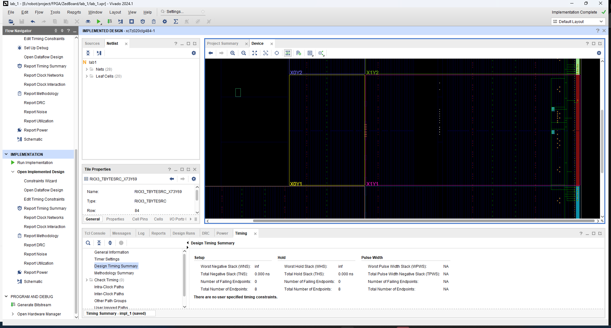

*Post Timing Simulation*


*Final Test*


### 3.2 Experiment 2
> **Important File:** [Lab 2 Manual](./datasheet/lab2.pdf)

**Code Analysis**

This experiment is more complex compared to the previous one, involving 6 Verilog files. Let’s first categorize them by hierarchy:</p>

- `uart_led.v`
  - `meta_harden.v`
  - `uart_rx.v`
    - `meta_harden.v`
    - `uart_baud_gen.v`
    - `uart_rx_ctl.v`
  - `led_ctl.v`

This is the design hierarchy for this lab. It can be understood that each `.v` file calls the module(s) in other `.v` files, ultimately forming a complete project.</p>
We will analyze it from top to bottom, starting with the `uart_led.v` file. This top-level file mainly calls modules and passes parameters to integrate UART and LED functionality. You can refer to the code for more details.</p>
The `led_ctl.v` file defines an LED module that can accept 8-bit data and display it on the LED module.</p>
The main implementation of the code is as follows:
```verilog
  always @(posedge clk_rx)
  begin
    if (rst_clk_rx)
    begin
      old_rx_data_rdy <= 1'b0;
      char_data       <= 8'b0;
      led_o           <= 8'b0;
    end
    else
    begin
      // Capture the value of rx_data_rdy for edge detection
      old_rx_data_rdy <= rx_data_rdy;

      // If rising edge of rx_data_rdy, capture rx_data
      if (rx_data_rdy && !old_rx_data_rdy)
      begin
        char_data <= rx_data;
      end

      // Output the normal data or the data with high and low swapped
      if (btn_clk_rx)
        led_o <= {char_data[3:0],char_data[7:4]};
      else
        led_o <= char_data;
    end // if !rst
  end // always
```
In the `always @(posedge clk_rx)` block, the code is executed every time there is a rising edge on `clk_rx`. It first checks `if (rst_clk_rx)` to determine if the module is in a reset state. If it is, then `old_rx_data_rdy`, `char_data`, and `led_o` are all set to 0 (i.e., resetting all states). Otherwise, it proceeds to the `else` section.</p>

When not in reset state (entering the `else` block), the first step is to assign the parameter `rx_data_rdy` (which indicates UART data is ready) using the non-blocking assignment `<=` to `old_rx_data_rdy`.</p>
<sub>Note that `<=` is a non-blocking assignment, meaning that the value will be updated only after all `always` blocks have finished executing!!!</sub></p>

Next, it checks `if (rx_data_rdy && !old_rx_data_rdy)`.</p>
This logic determines if `rdy` is `1` in the current clock cycle (indicating that RX data is available) while `rdy` was `0` in the previous clock cycle (indicating no data was available in the previous cycle). If both conditions are true, it means this is `new data`, and `char_data` is updated to `rx_data` (i.e., the UART data).</p>
<sub>Note that due to the non-blocking assignment, `old_rx_data_rdy` is still holding the value from the previous clock cycle during the `if` check, and hence `char_data` is updated after the `always` block completes its execution.</sub></p>

The final part is about displaying the data on the LEDs. It first checks the value of `btn_clk_rx` (an external button input). If it is `1`, the lower 4 bits and upper 4 bits of `led_o` are swapped. Otherwise, `char_data` is displayed directly.</p>

***

Next, let’s explain the purpose of `meta_harden.v` and `uart_baud_gen.v`.</p>

The `meta_harden.v` module mainly implements the function of **double synchronization**, which aims to synchronize an asynchronous signal into the target clock domain.</p>

Simply put, if the asynchronous signal is a button, the button press is not synchronized with the FPGA clock signal. If it is pressed exactly at the rising edge of the clock, it could result in the button's signal being unstable (metastable), which could cause issues during subsequent reads. This is a common issue with synchronizing asynchronous signals, and thus a double synchronization process is required.</p>

The implementation code is as follows:
```verilog
  always @(posedge clk_dst)
  begin
    if (rst_dst)
    begin
      signal_meta <= 1'b0;
      signal_dst  <= 1'b0;
    end
    else // if !rst_dst
    begin
      signal_meta <= signal_src;
      signal_dst  <= signal_meta;
    end // if rst
  end // always
```
Implementing double synchronization is not very complicated. First, it is important to understand the concept of non-blocking assignment mentioned earlier. Specifically, `<=` operations are only updated after all `always` blocks have completed execution. In this module, `signal_src` is first assigned to `signal_meta`, and then in the next clock cycle, `signal_meta` is assigned to `signal_dst`.</p>
<sub>Of course, based on this principle, you could implement **n-level synchronization** by adding more `<=` assignments as needed, depending on project requirements.</sub></p>

***

The `uart_baud_gen.v` module is primarily used to generate the baud rate, focusing on implementing **oversampling**.</p>
Let's first understand the logical part of it, and then analyze how to determine the frequency count value.</p>
The logical code is as follows:

```verilog
assign internal_count_m_1 = internal_count - 1'b1;
  always @(posedge clk)
  begin
    if (rst)
    begin
      internal_count  <= OVERSAMPLE_VALUE;
      baud_x16_en_reg <= 1'b0;
    end
    else
    begin
      // Assert baud_x16_en_reg in the next clock when internal_count will be
      // zero in that clock (thus when internal_count_m_1 is 0).
      baud_x16_en_reg   <= (internal_count_m_1 == {CNT_WID{1'b0}});
      // Count from OVERSAMPLE_VALUE down to 0 repeatedly
      if (internal_count == {CNT_WID{1'b0}}) 
      begin
        internal_count    <= OVERSAMPLE_VALUE;
      end
      else // internal_count is not 0
      begin
        internal_count    <= internal_count_m_1;
      end
    end // if rst
  end // always 
```
First, let's roughly understand the purpose of `assign internal_count_m_1 = internal_count - 1'b1;`. This is a continuous assignment statement, which is implemented through combinational logic in hardware. When `internal_count` changes, `internal_count_m_1` also changes immediately, without needing clock synchronization.</p>

The `always @(posedge clk)` block is triggered on every rising edge of the clock (`clk`). When the module is in reset, `internal_count` is assigned the value of `OVERSAMPLE_VALUE`, and `baud_x16_en_reg` is set to 0.</p>

The above logic implements triggering `baud_x16_en_reg` after a certain number of clock cycles. For example, if the clock frequency is 1 kHz, and it triggers every 10 cycles, that means it achieves sampling at 100 Hz. If the baud rate is 10 Hz, then it is a 10-times oversampling.</p>

The implementation code is as follows:
```verilog
  parameter BAUD_RATE    = 57_600;              // Baud rate
  parameter CLOCK_RATE   = 50_000_000;
  // The OVERSAMPLE_RATE is the BAUD_RATE times 16
  localparam OVERSAMPLE_RATE = BAUD_RATE * 16;
  // The divider is the CLOCK_RATE / OVERSAMPLE_RATE - rounded up
  // (so add 1/2 of the OVERSAMPLE_RATE before the integer division)
  localparam DIVIDER = (CLOCK_RATE+OVERSAMPLE_RATE/2) / OVERSAMPLE_RATE;
  // The value to reload the counter is DIVIDER-1;
  localparam OVERSAMPLE_VALUE = DIVIDER - 1;
  // The required width of the counter is the ceiling of the base 2 logarithm
  // of the DIVIDER
  localparam CNT_WID = clogb2(DIVIDER);
```
This part is used to calculate the value of `OVERSAMPLE_VALUE`, which determines how many clock cycles are required to trigger `baud_x16_en_reg` each time, as mentioned above.</p>

Subtracting 1 is because the counter starts from 0.</p>

The purpose of `clogb2(DIVIDER)` is to calculate the number of bits needed to represent `DIVIDER` in binary. This ensures an appropriate counter width, which can help save resources.</p>

The implementation code is as follows:
```verilog
  function integer clogb2;
    input [31:0] value;
    reg   [31:0] my_value;
    begin
      my_value = value - 1;
      for (clogb2 = 0; my_value > 0; clogb2 = clogb2 + 1)
        my_value = my_value >> 1;
    end
  endfunction
```
The main logic is to keep right-shifting `value` until it becomes 0, and for each shift operation, `clogb2` is incremented by 1. Finally, the resulting `clogb2` represents the number of bits required to represent `value` in binary.</p>

***

Finally, let's discuss the purpose of `uart_rx.v` and `uart_rx_ctl.v`.</p>
The `uart_rx.v` module primarily calls other modules and passes parameters, similar to what `uart_led.v` does.</p>
The main focus is on `uart_rx_ctl.v`, which is responsible for implementing a UART receiver controller that receives UART data and decodes it.</p>
This part of the code is quite long, with detailed comments, so here we will briefly explain its purpose. Please refer to the code for specific details.</p>

There are five `always` blocks that run concurrently, and we will refer to them as `Module X` in the following explanations.</p>
- **`Module 1`** implements a state machine function, updating the state at each rising edge of the clock cycle.</p>
- **`Module 2`** checks if data is available, and then reads the current bit's value on the eighth oversampling cycle. Subsequent readings occur every 16 oversampling cycles, starting from the middle of the start bit. This helps ensure stability and prevents issues from unstable data.</p>
- **`Module 3`** is responsible for tracking the number of bits read so far.</p>
- **`Module 4`** checks if the correct number of bits have been read and generates the `rx_data_rdy` signal.</p>
- **`Module 5`** is used for stop bit verification. Normally, the stop bit should be `1`. If it is not, this indicates a data error, which is communicated through the `frm_err` signal.</p>

It is important to note that all of these `always` blocks execute concurrently, meaning they all start executing simultaneously on the rising edge of the clock (they use the data from the previous clock cycle).</p>
**Experimental Results**

The following images and animations show the results of the experiment:

*Pre-Optimization Schematic*
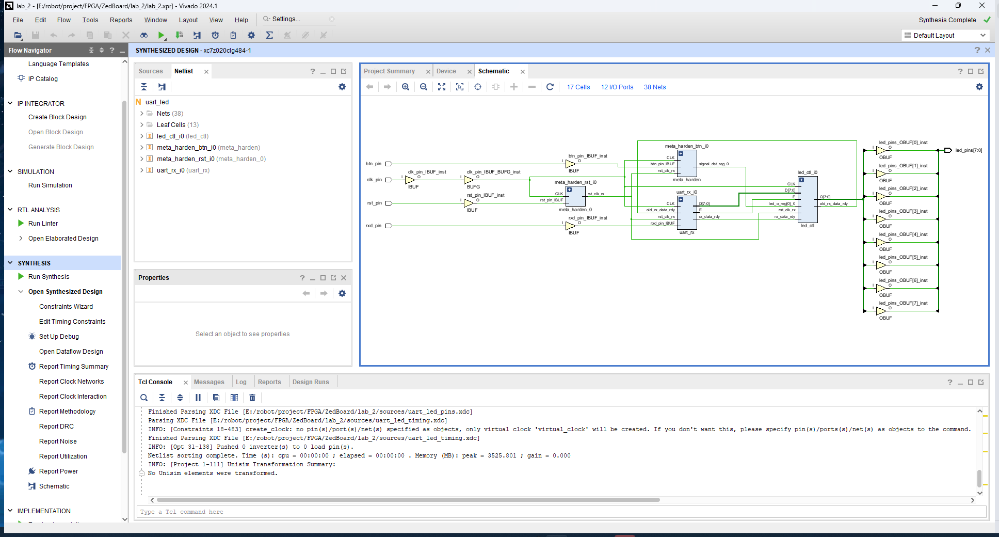

*Device View*
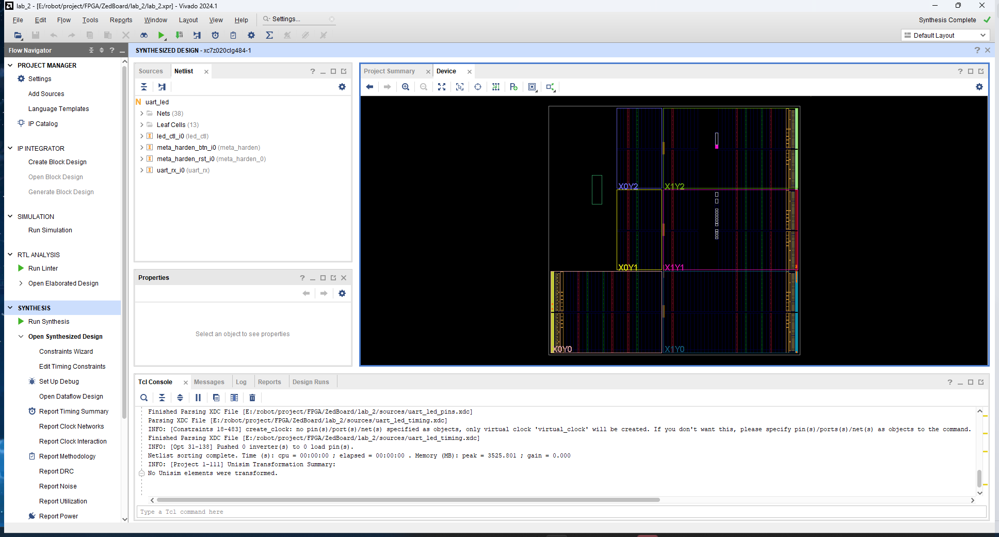

*Power Report*
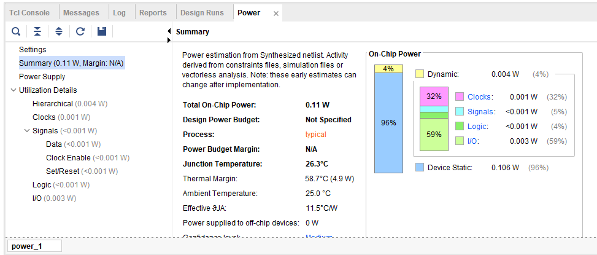

*Project Summary*


*Post-Optimization Schematic*


*Timing Analysis Report (with Timing Violations)*
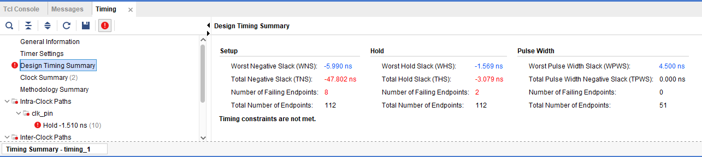

*Checkpoint File*


### 3.3 Experiment 3
> **Important Document:** [Lab 3 Manual](./datasheet/lab3.pdf)

**Code Analysis**
The code for this lab is the same as Lab 2, so it will not be repeated here.</p>

**Experimental Results**

*Timing Report*
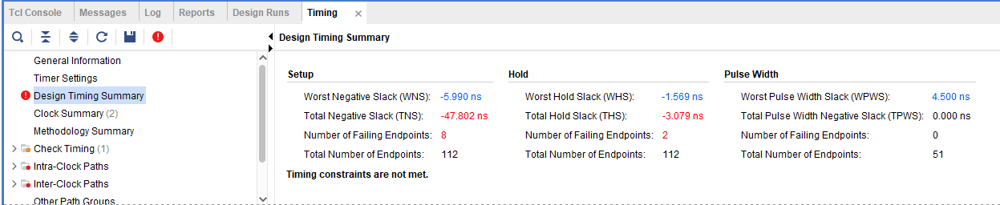

*Output Data Path*


*Timing After Change*


*Device Path*
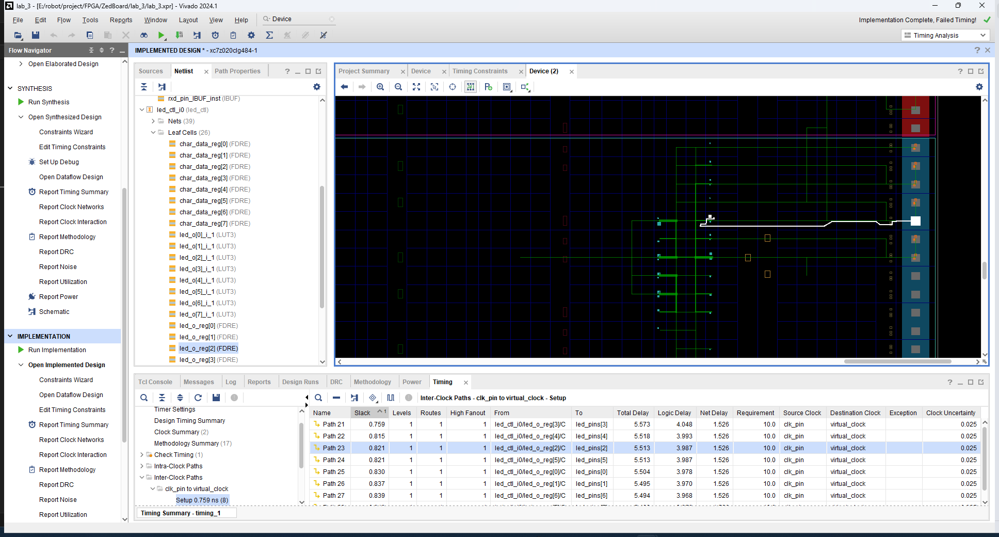

*Project Summary*


*Timing Report Implementation*


*Timing After Change Implementation*
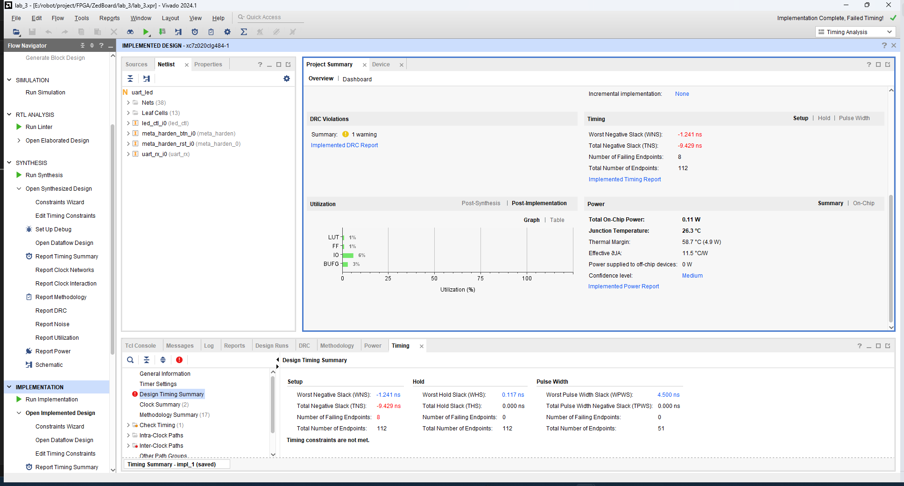

*Clock Path*
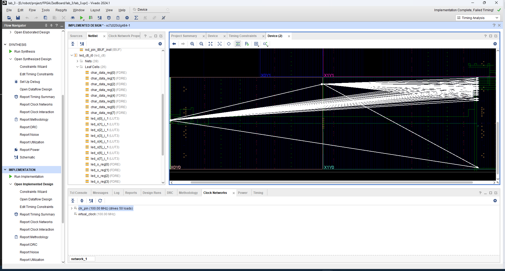

*Final Test*
Currently not working, pending issue resolution!


### 3.4 Experiment 4
> **Important Document:** [Lab 4 Manual](./datasheet/lab4.pdf)

(In Development)

### 3.5 Experiment 5
> **Important Document:** [Lab 5 Manual](./datasheet/lab5.pdf)

(In Development)

### 3.6 Experiment 6
> **Important Document:** [Lab 6 Manual](./datasheet/lab6.pdf)

## 4. Course Design (In Development)

