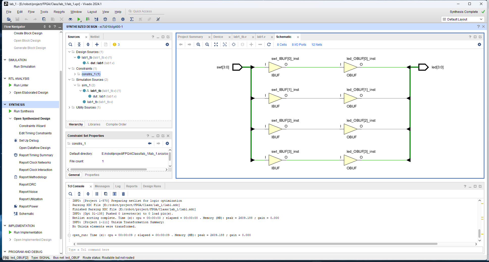

[中文](README.md) | English
- [Front-end Design of Digital Integrated Circuits and High-level Synthesis](#front-end-design-of-digital-integrated-circuits-and-high-level-synthesis)
  - [1. Preface](#1-preface)
    - [1.1 Software and Hardware Environment](#11-software-and-hardware-environment)
  - [2. Lab Content](#2-lab-content)
    - [2.1 Lab 1](#21-lab-1)
    - [2.2 Lab 2](#22-lab-2)
    - [2.3 Lab 3](#23-lab-3)
    - [2.4 Lab 4](#24-lab-4)
    - [2.5 Lab 5](#25-lab-5)
    - [2.6 Lab 6](#26-lab-6)
  - [3. Course Design (In Progress)](#3-course-design-in-progress)

# Front-end Design of Digital Integrated Circuits and High-level Synthesis
## 1. Preface
This course is offered by the School of Electronics and Information Technology (School of Microelectronics) at Sun Yat-sen University.

This is a practical course where you can learn **a lot of things**. Since the provided lab board is different from the one at hand, modifications were made to the code to adapt it to my board.

The purpose of this project is, firstly, to complete the six labs and the course design as part of the coursework submission. Secondly, it aims to provide a reference for those who may use the same board in the future (as I have noticed that this board is still quite popular among FPGA buyers).

### 1.1 Software and Hardware Environment
- Windows 11
- Vivado 2024.1
- Chip: xc7z010clg400-1
  
**PCB-Level Resources**:
  - [Schematic](./datasheet/AX7010开发板原理图.pdf) (Very important, contains definitions of various pins)
  - [PCB Design Guide](./datasheet/ug933-Zynq-7000-PCB.pdf)
  
**Chip-Level Resources**:
  - [Zynq-7000 Data Sheet](./datasheet/ds187-XC7Z010-XC7Z020-Data-Sheet.pdf)
  - [XADC User Guide](./datasheet/ug480_7Series_XADC.pdf)
  - [Technical Reference Manual (TRM)](./datasheet/ug585-Zynq-7000-TRM.pdf)
  - [Software Development Guide](./datasheet/ug821-zynq-7000-swdev.pdf)
  - [Package Pinout Guide](./datasheet/ug865-Zynq-7000-Pkg-Pinout.pdf)

**Board**:

## 2. Lab Content
### 2.1 Lab 1
> **Important Document:** [Lab 1 Manual](./datasheet/lab1.pdf)

The detailed steps are provided in the PDF above. In this project, the main goal is to modify the three files `labX.v`, `lab1_tb.v`, and `lab1.xdc` to adapt them to the specific board.

The three files correspond to Verilog code, Testbench code, and constraints, respectively:
- **`labX.v`**: Hardware description
- **`lab1_tb.v`**: Simulation
- **`lab1.xdc`**: Constraints

**Lab Results**:

The following images and animation show the results of the experiment:

*Behavioral Simulation*

*Project Summary*

*Schematic after Synthesis*

*Device Implementation*

*Post-Timing Simulation*

*Final Test*

### 2.2 Lab 2
> **Important Document:** [Lab 2 Manual](./datasheet/lab2.pdf)

(In development)

### 2.3 Lab 3
> **Important Document:** [Lab 3 Manual](./datasheet/lab3.pdf)

(In development)

### 2.4 Lab 4
> **Important Document:** [Lab 4 Manual](./datasheet/lab4.pdf)

(In development)

### 2.5 Lab 5
> **Important Document:** [Lab 5 Manual](./datasheet/lab5.pdf)

(In development)

### 2.6 Lab 6
> **Important Document:** [Lab 6 Manual](./datasheet/lab6.pdf)

(In development)

## 3. Course Design (In Progress)

